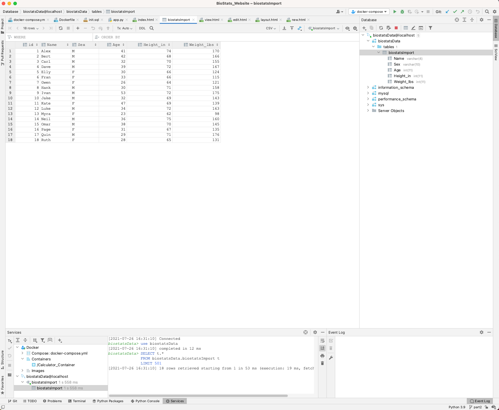
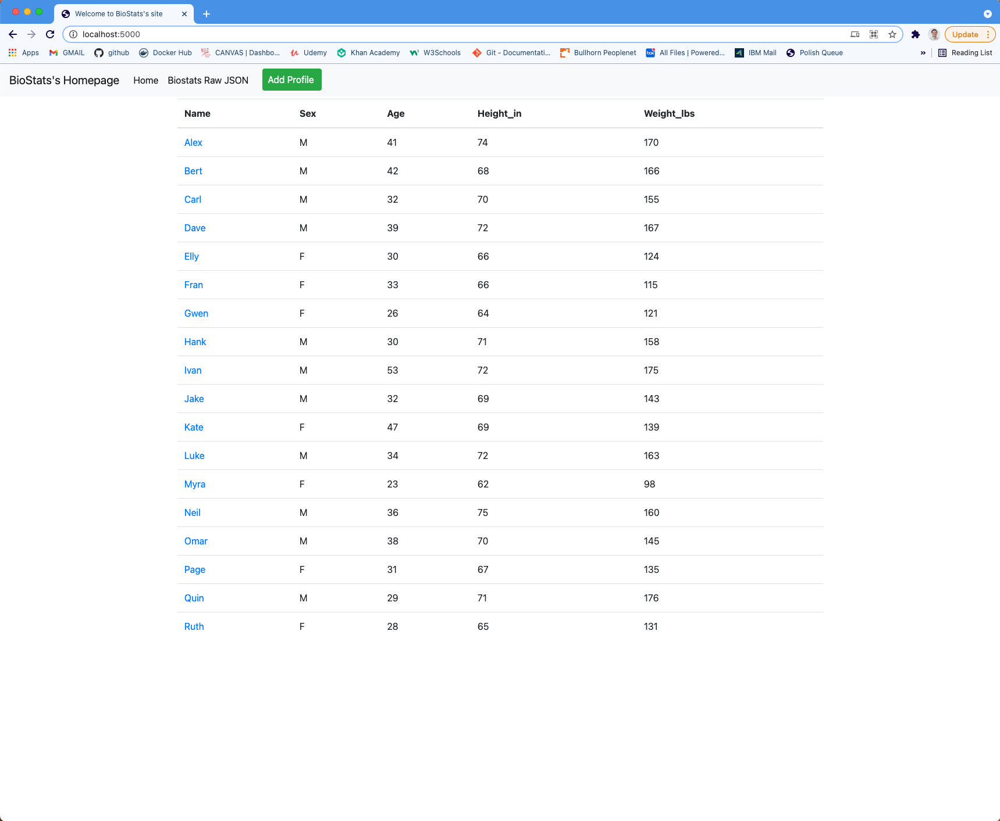
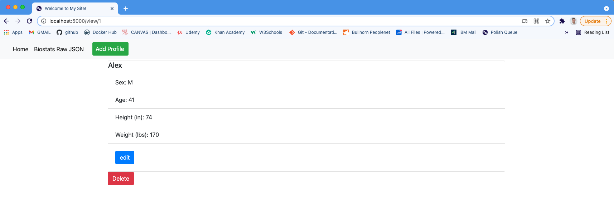
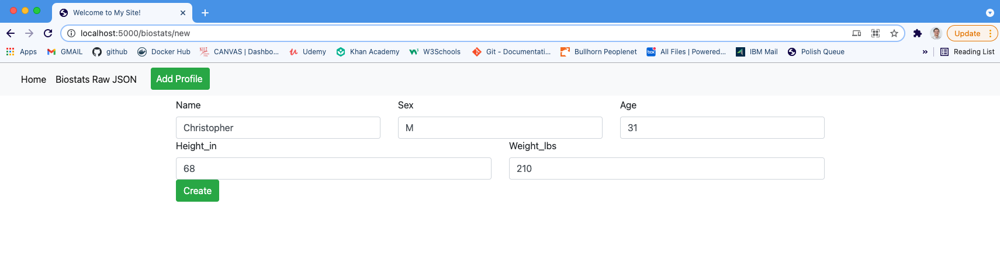
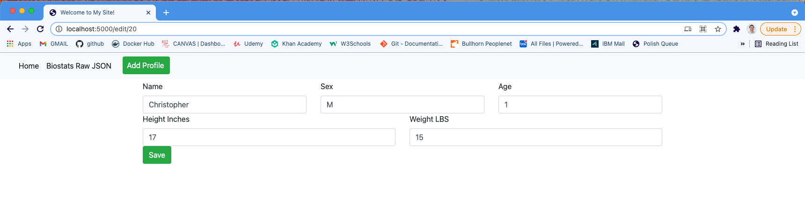
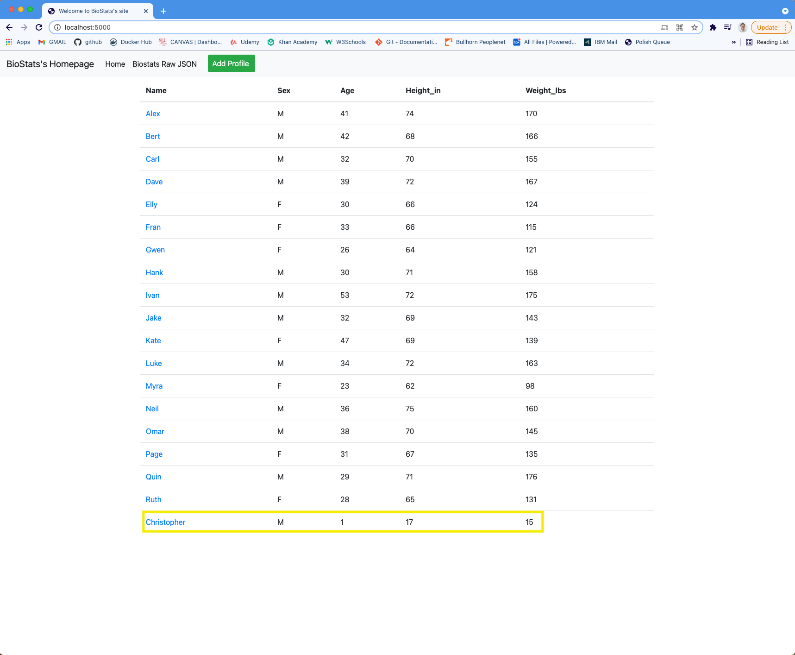
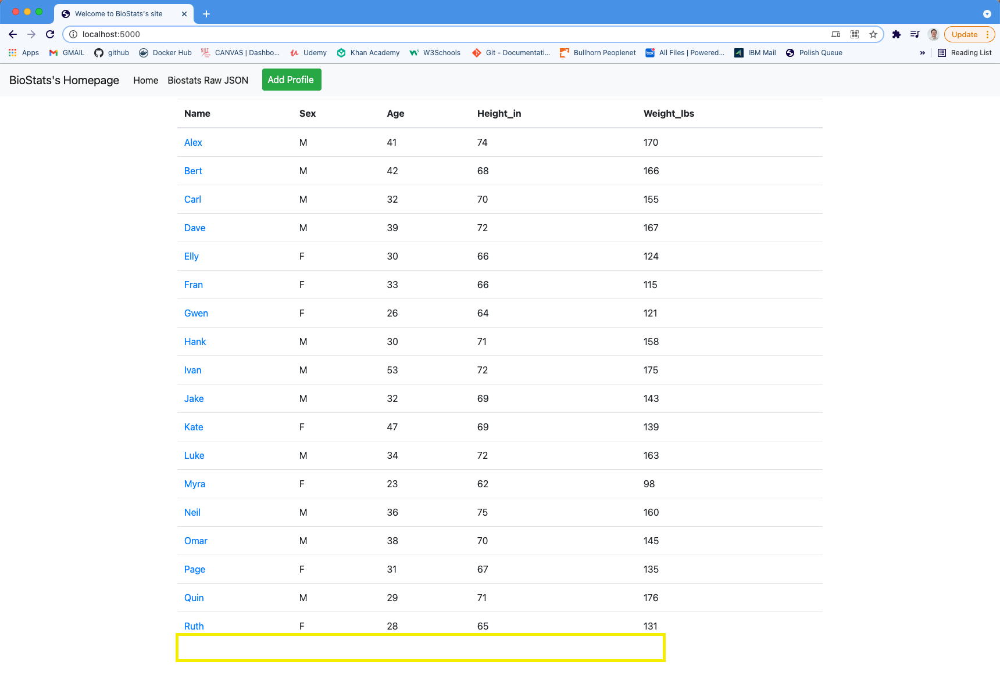

# Project Description 
This project is a homework assignment to teach how to get Pycharm setup with Docker, Flask, MySQL, and Postman
# a. Pycharm Data Tables

# b. Home Page 

# c. View Page 

# d. Add Page 

# e. Updated Record 

# f. Deleted Record 

